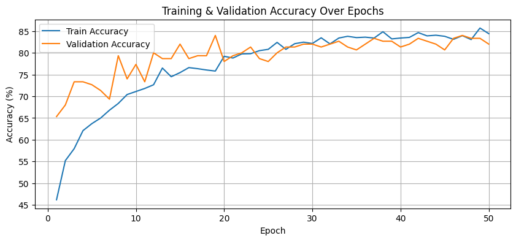
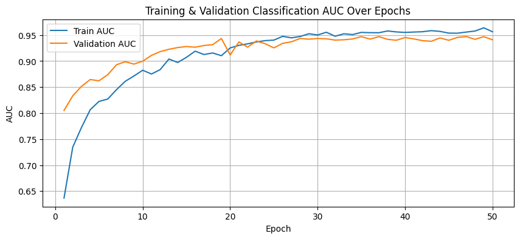
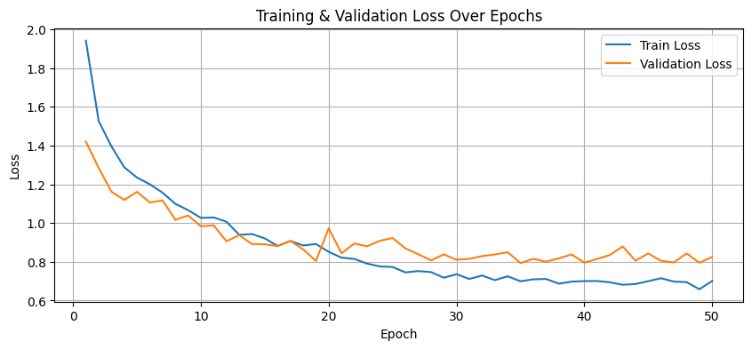
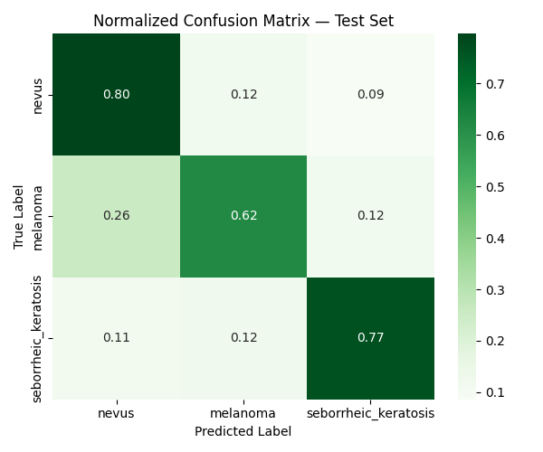

# Skin-Cancer-Multitask-model

Access link: https://skin-cancer-multitask-model.streamlit.app/


A **multi-task deep learning framework** for automated skin cancer analysis using dermoscopic images.
The model simultaneously performs:

* **Lesion Segmentation**
* **Dermoscopic Feature Detection**
* **Disease Classification**

using a **shared backbone neural network**.

This project is based on the **ISIC 2017 Skin Lesion Analysis dataset** and aims to improve diagnostic performance by leveraging **multi-task learning**.

---

# Project Overview

Skin cancer is one of the most common cancers worldwide. Early detection is critical for effective treatment.
This project proposes a **multi-task deep learning architecture** capable of learning complementary tasks from dermoscopic images.

Instead of training separate models for each task, a **shared feature extractor** is used to improve efficiency and performance.

---

# Tasks Performed

### 1. Lesion Segmentation

Detects the precise boundary of the skin lesion.

Output:

* Binary segmentation mask

Evaluation Metric:

* Dice Coefficient

---

### 2. Dermoscopic Feature Detection

Identifies important dermoscopic structures such as:

* Pigment network
* Milia-like cysts
* Globules
* Streaks

Evaluation Metric:

* F1 Score

---

### 3. Disease Classification

Classifies skin lesions into:

* **Melanoma**
* **Seborrheic Keratosis**
* **Nevus**

Evaluation Metrics:

* Accuracy
* AUC (Area Under ROC Curve)

---

# Model Architecture

The architecture uses a **shared backbone network** with task-specific heads.

Backbone:

* EfficientNet / ResNet

Task Heads:

1. **Segmentation Head**

   * U-Net decoder

2. **Detection Head**

   * Feature prediction layers

3. **Classification Head**

   * Fully connected layers

Architecture diagram:


---

# Dataset

Dataset used:

**ISIC 2017 Skin Lesion Analysis Dataset**

Tasks available in the dataset:

| Task                          | Description             |
| ----------------------------- | ----------------------- |
| Lesion Segmentation           | Binary mask of lesion   |
| Dermoscopic Feature Detection | Dermoscopic structures  |
| Disease Classification        | Melanoma vs SK vs Nevus |

Dataset source:
https://challenge.isic-archive.com

---

# Project Structure

```
Skin-Cancer-Multitask-ML-model
│
├── Skin-Cancer-Multitasking-Model.ipynb
│
├── output_images
│   ├── Architecture.png
│   ├── accuracy_plot.png
│   ├── auc_plot.png
│   ├── loss_plot.png
│   ├── dice_plot.png
│   ├── feat_f1_plot.png
│   ├── confusion_matrix_raw.png
│   ├── confusion_matrix_norm.png
│   ├── sample predictions.png
│   ├── sample predictions1.png
│   └── sample predictions2.png
│
├── output_metrics
│   ├── training_history.csv
│   ├── training_history.xlsx
│   ├── classification_report.csv
│   └── best_val_class_report.csv
│
└── README.md
```

---

# Training Details

Training strategy includes:

* Multi-task loss optimization
* Weighted sampling for class imbalance
* Data augmentation using **Albumentations**
* Shared feature extraction backbone

Optimization:

* Adam optimizer
* Learning rate scheduling
* Early stopping

---

# Results

### Training Metrics

Accuracy, AUC, Dice score and Feature F1 score were tracked during training.

Example plots:

**Accuracy**



**AUC**



**Loss**



---

### Confusion Matrix



---

# Sample Predictions

Example outputs from the model:


---

# Technologies Used

* Python
* PyTorch
* Albumentations
* NumPy
* Pandas
* Matplotlib
* Scikit-learn

---

# Future Improvements

* Train on larger datasets (ISIC 2018 / ISIC 2019)
* Improve feature detection head
* Add attention mechanisms

---

# Author

**B V Pravallika, K Jayaveera Kumar**

GitHub:
https://github.com/Pravallika0730/
---

# License

This project is intended for **research and educational purposes only**.
